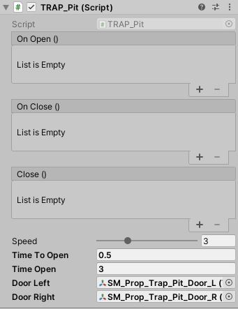
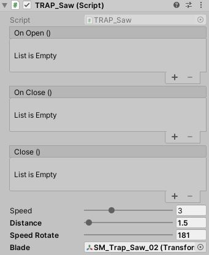
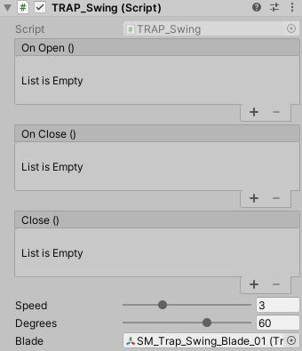

# Traps

Pit Trap          |  Saw Trap          |  Swing Trap
:-------------------------:|:-------------------------:|:-------------------------:
 |   |  

All traps inherit from the TRAP parent class that has the events shown by inspector. With this, we can add more personalized interaction to each trap
Pit Trap          |  Saw Trap          |  Swing Trap
:-------------------------:|:-------------------------:|:-------------------------:
 |   |  
